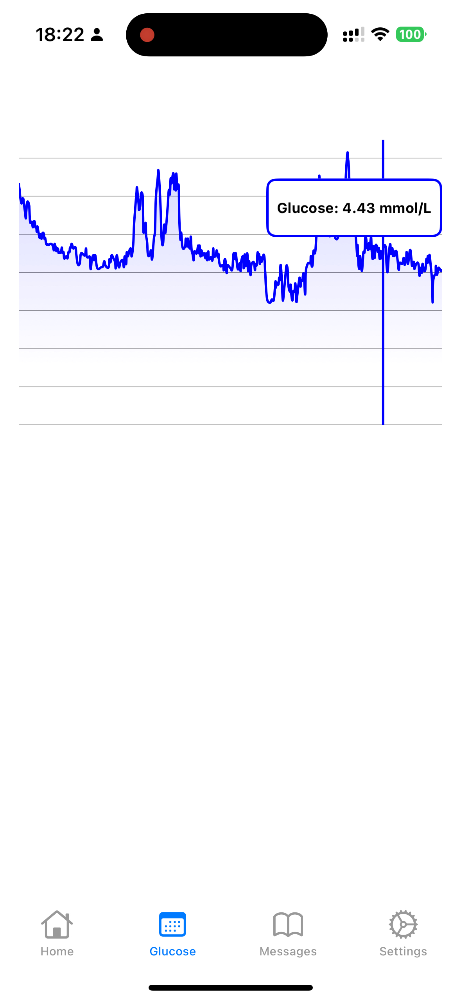

# ble_app

BLE app that scans predefined service and readable characteristic and notifies each 10 second its value. On the 2nd tab there is an interactive graph with a customized label.

|                                           video                                           |                              image                               |
| :---------------------------------------------------------------------------------------: | :--------------------------------------------------------------: |
|  |  |

## Getting Started

```sh
tuist install
tuist generate
```

It was initialized with the following command:

```sh
tuist init --platform ios --name iOSProject
```

Make sure Info.plist is configured correctly:

```xml
    <!-- Bluetooth Permissions -->
    <key>NSBluetoothAlwaysUsageDescription</key>
    <string>This app requires Bluetooth to scan for and connect to BLE devices.</string>
    <key>NSBluetoothPeripheralUsageDescription</key>
    <string>This app needs Bluetooth to communicate with your devices.</string>

    <!-- Location Permissions -->
    <key>NSLocationWhenInUseUsageDescription</key>
    <string>Location is required to detect nearby Bluetooth devices.</string>
    <key>NSLocationAlwaysUsageDescription</key>
    <string>Location is required in the background to connect to your BLE devices.</string>

    <!-- Background Modes -->
    <key>UIBackgroundModes</key>
    <array>
        <string>bluetooth-central</string>
        <string>location</string>
    </array>
```
